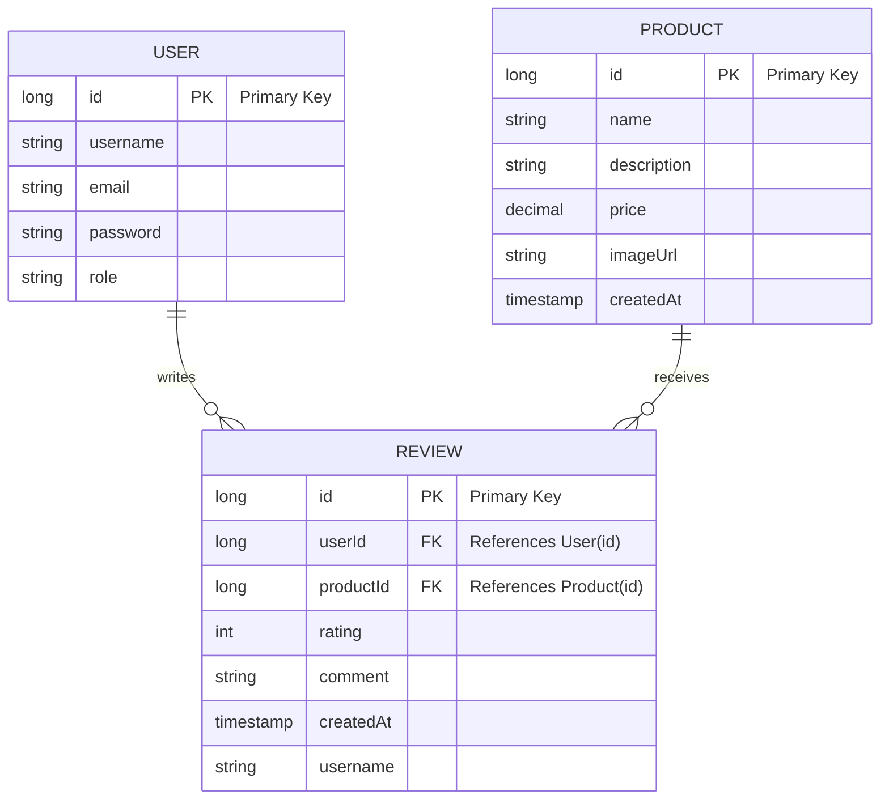

# Cartella (E-Commerce Web Application)

[](https://www.oracle.com/java/)
[](https://jakarta.ee/specifications/servlet/)
[](https://www.mysql.com/)
[](https://redis.io/)
[](https://maven.apache.org/)
[](https://jwt.io/)
[](https://github.com/davidscotttufts/bcrypt)

A robust e-commerce web application built with Java Servlets and MVC architecture. It features dual authentication methods (Session + JWT), comprehensive product management, user reviews, Redis caching, and rate limiting — following clean separation of concerns with Controller, Service, and DAO layers.

---

##  Features

###  User Features
- Register and login with email & password
- Session-based authentication (stateful)
- JWT token-based authentication (stateless) via REST API
- Sign out and delete account
- Role-based access control (USER / ADMIN)

###  Product Features
- View all products on the home page
- Browse full product catalog
- View detailed product information
- Search products by keyword
- Redis caching for fast product retrieval

###  Review Features
- Logged-in users can submit reviews with ratings (1–5)
- View all reviews on the home page
- View product-specific reviews on the product details page

###  Admin Features
- Add new products with details and pricing
- Update existing product information
- Delete products
- Admin-only dashboard with product statistics

###  Security & Performance
- AuthFilter protects secured endpoints
- AdminFilter restricts admin routes
- JWT filter for REST API endpoints
- Rate limiting using Redis (100 requests/minute per IP)
- BCrypt password hashing

---

##  Technologies Used

| Technology | Purpose |
|------------|---------|
| **Java 8** | Core backend language |
| **Java Servlets 6.1** | Request handling and routing |
| **MySQL 9.2** | Relational database for users, products, and reviews |
| **Redis (Jedis 5.1)** | Caching and rate limiting |
| **JWT (JJWT 0.11.5)** | Stateless token authentication |
| **BCrypt** | Secure password hashing |
| **Gson** | JSON serialization/deserialization |
| **Maven** | Dependency and build management |
| **SLF4J** | Logging framework |
| **Tomcat** | Servlet container |

---

##  Project Structure

```
src/main/java/com/ecommerce/
├── controller/
│   ├── auth/
│   │   ├── LoginController.java
│   │   ├── RegisterController.java
│   │   ├── LogoutController.java
│   │   └── DeleteAccountController.java
│   ├── product/
│   │   ├── AddProductController.java
│   │   ├── DeleteProductController.java
│   │   ├── UpdateProductController.java
│   │   ├── ProductDetailController.java
│   │   ├── AddReviewController.java
│   │   ├── DeleteReviewController.java
│   │   └── UpdateReviewController.java
│   └── HomeController.java
├── service/
│   ├── AuthService.java
│   ├── ProductService.java
│   ├── ReviewService.java
│   └── CacheService.java
├── dao/
│   ├── UserDao.java
│   ├── ProductDao.java
│   └── ReviewDao.java
├── model/
│   ├── User.java
│   ├── Product.java
│   └── Review.java
├── filter/
│   ├── AuthFilter.java
│   ├── RateLimitFilter.java
│   └── ExceptionHandlerFilter.java
├── config/
│   └── DatabaseConnection.java
├── listener/
│   └── AppContextListener.java
└── util/
    ├── JwtUtil.java
    ├── ValidationUtil.java
    └── CacheConstants.java
```

---

##  URL Endpoints

### Page Routes (Servlet)
| Method | URL | Description |
|--------|-----|-------------|
| GET | `/` | Home page — products & reviews |
| GET | `/signin` | Sign in page |
| POST | `/signin` | Handle login |
| GET | `/signup` | Sign up page |
| POST | `/signup` | Handle registration |
| GET | `/signout` | Sign out & invalidate session |
| GET | `/products` | All products page |
| GET | `/products/view/{id}` | Product details & reviews |
| POST | `/products/view/{id}` | Submit a review |
| GET | `/admin/products` | Admin dashboard |
| GET | `/admin/products/add` | Add product form |
| POST | `/admin/products/add` | Save new product |
| GET | `/admin/products/update/{id}` | Edit product form |
| POST | `/admin/products/update` | Save product update |
| POST | `/admin/products/delete` | Delete product |

### REST API Routes (JWT-protected)
| Method | URL | Description |
|--------|-----|-------------|
| POST | `/api/auth/login` | Login → returns JWT token |
| POST | `/api/auth/register` | Register → returns JWT token |
| GET | `/api/auth/validate` | Validate JWT token |

---

##  Database Schema



---

##  Setup & Configuration

### Prerequisites
- Java 8+
- MySQL 9.2+
- Redis (local or cloud)
- Apache Tomcat
- Maven 3.6+

---

##  Authentication Flow

### Session-based (Web UI)
```
User submits login form
    → LoginController (POST /signin)
    → UserService.login()
    → BCrypt password check
    → session.setAttribute("loggedUser", user)
    → Redirect to home
```

### JWT-based (REST API)
```
Client sends POST /api/auth/login with JSON body
    → AuthController
    → UserService.login()
    → JWTUtil.generateToken(email, role)
    → Returns { token: "..." }

Client sends request with header:
    Authorization: Bearer <token>
    → JWTAuthFilter validates token
    → Sets userEmail & userRole on request
```

---

##  Caching Strategy (Redis)

| Cache Key | TTL | Description |
|-----------|-----|-------------|
| `products:all` | 10 min | All products list |
| `product:{id}` | 15 min | Single product |
| `reviews:all` | 15 min | All reviews |
| `reviews:product:{id}` | 20 min | Reviews per product |
| `rate_limit:{ip}:{endpoint}` | 1 min | Rate limiting counter |

Cache is automatically invalidated on any create / update / delete operation.

---

##  Rate Limiting

- **Limit:** 100 requests per minute per IP address
- **Scope:** All endpoints (`/*`)
- **Storage:** Redis counter with 1-minute TTL
- **Response on exceed:** HTTP 429 — `Rate limit exceeded. Try again later.`

---

## Filters

| Filter | URL Pattern | Purpose |
|--------|-------------|---------|
| `AuthFilter` | `/products/*`, `/admin/*` | Checks session login, blocks unauthenticated users |
| `AdminFilter` | `/admin/*` | Checks ADMIN role |
| `JWTAuthFilter` | `/api/*` | Validates JWT token for REST endpoints |
| `RateLimitFilter` | `/*` | Redis-based rate limiting |

---

##  Default Roles

| Role | Permissions |
|------|-------------|
| `USER` | Browse products, submit reviews, view profile |
| `ADMIN` | All USER permissions + add/update/delete products |

> To create an admin account, manually update the role in the database:
> ```sql
> UPDATE users SET role = 'ADMIN' WHERE email = 'admin@example.com';
> ```

---

##  API Documentation

### Authentication Endpoints
| Method | Endpoint | Description |
|--------|----------|-------------|
| POST | `/api/auth/login` | User login with email and password |
| POST | `/api/auth/register` | User registration |
| GET | `/api/auth/validate` | Validate JWT token |

### Product Endpoints
| Method | Endpoint | Description |
|--------|----------|-------------|
| GET | `/` | Home page with all products |
| GET | `/products` | Browse all products |
| GET | `/products/view/{id}` | View product details and reviews |
| POST | `/products/view/{id}` | Submit a review for product |

### Admin Endpoints
| Method | Endpoint | Description |
|--------|----------|-------------|
| GET | `/admin/products` | Admin dashboard |
| GET | `/admin/products/add` | Add new product form |
| POST | `/admin/products/add` | Save new product |
| GET | `/admin/products/update/{id}` | Edit product form |
| POST | `/admin/products/update` | Save product updates |
| POST | `/admin/products/delete` | Delete product |


---

##  Security Features

- **Dual Authentication**: Session-based for web UI, JWT for REST API
- **Password Security**: BCrypt hashing for secure password storage
- **Role-based Access**: USER and ADMIN roles with appropriate permissions
- **Rate Limiting**: Redis-based rate limiting (100 requests/minute per IP)
- **Input Validation**: Server-side validation for all user inputs
- **SQL Injection Protection**: Prepared statements used throughout

---

##  Performance Features

- **Redis Caching**: Frequently accessed data cached for faster response
- **Connection Pooling**: Efficient database connection management
- **Optimized Queries**: Well-structured SQL queries for better performance
- **Lazy Loading**: Resources loaded only when needed

---

##  Development Features

- **Clean Architecture**: MVC pattern with clear separation of concerns
- **Dependency Injection**: Manual DI implementation for loose coupling
- **Exception Handling**: Centralized exception handling mechanism
- **Logging**: SLF4J for comprehensive logging
- **Build Automation**: Maven for dependency management and building

---
